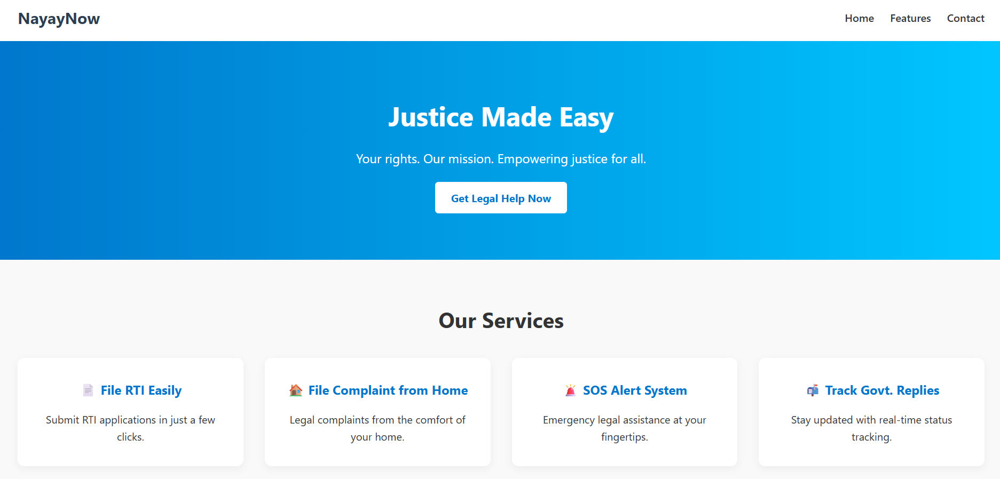

# ⚖️ NayayNow – Justice Made Easy

**NayayNow** is a simple, clean, and responsive frontend web application that empowers users to access legal help and services online. From filing RTIs to tracking government responses and sending SOS alerts, this platform aims to make justice accessible to all.

---

## 🌐 **_Live Demo_**

> 🚧 [NayayNow_Landing_Page](https://nayaynow-landing-page.netlify.app/)

---

## 🧰 **_Tech Stack_**

- 🔵 HTML5
- 🎨 CSS3

---

## 📸 **_Preview_**

---

## 🛠️ **_Tools_**

- 🧠 Visual Studio Code
- 🌀 Git and GitHub
- 🌍 Netlify

---

## 🔥 **_Features_**

- 🎯 Hero section with clear CTA
- 📄 File RTI easily
- 🏠 File complaints from home
- 🚨 SOS emergency alert system
- 📬 Track government replies
- 👩‍⚖️ Real user testimonial section
- 📱 Fully responsive design

---

